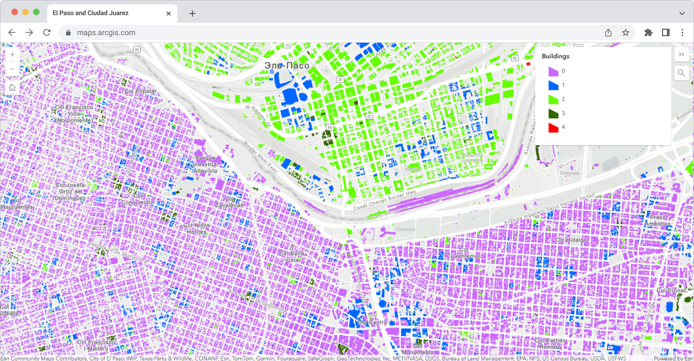

# Comparison of the morphology of El Paso and Ciudad Juarez
Code repository for the **Comparison of the morphology of El Paso and Ciudad Juarez** paper.

> Kaluzhak A. D. Comparison of the morphology of El Paso and Ciudad Juarez - 2024

Kaluzhak A. D. Faculty of Geography and Geoinformation Technology

Contact: ddkaluzhak@edu.hse.ru

Date: 11/03/2024

[](https://gymnasiumtsu.maps.arcgis.com/apps/instant/basic/index.html?appid=3ee8011f7a194ab7b67bcc2ae6c59da1)

The online interactive maps of the final classification are available at [https://gymnasiumtsu.maps.arcgis.com/apps/instant/basic/index.html?appid=3ee8011f7a194ab7b67bcc2ae6c59da1](https://gymnasiumtsu.maps.arcgis.com/apps/instant/basic/index.html?appid=3ee8011f7a194ab7b67bcc2ae6c59da1).

## Code

The code is in `code` containing cleaned reproducible
Python code for everyone willing to use the method.

### The method
The folder `code` contains generalised code for the method, that should be
reproducible on a custom data. The main notebook `main-code.ipynb` has
been updated to work with the recent releases of software. You can create the
reproducible environment to run it using `conda` or `mamba` and the `environment.yaml`
file in the `code` folder.

```
conda env create -f environment.yaml
```

You can also create a new environment `taxonomy` manually:

```
conda create -n taxonomy
conda activate taxonomy
conda config --env --add channels conda-forge
conda config --env --set channel_priority strict
conda install momepy mapclassify seaborn
```

## Data

Non-proprietary data are archived on figshare as
[ https://disk.yandex.ru/d/FCDGCTQAGu3h2Q](https://disk.yandex.ru/d/FCDGCTQAGu3h2Q). The
archive contains input geometry, generated geometry, all measured morphometric
characters and a final classification labels for El Paso and Ciudad Juarez.

The online interactive maps of the final classification are available at [https://gymnasiumtsu.maps.arcgis.com/apps/instant/basic/index.html?appid=3ee8011f7a194ab7b67bcc2ae6c59da1](https://gymnasiumtsu.maps.arcgis.com/apps/instant/basic/index.html?appid=3ee8011f7a194ab7b67bcc2ae6c59da1).

